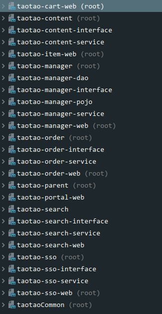
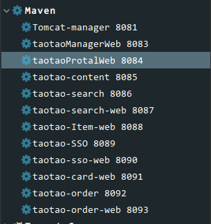
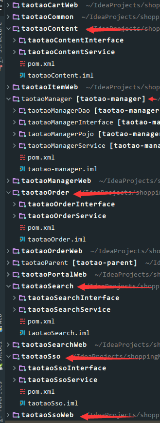
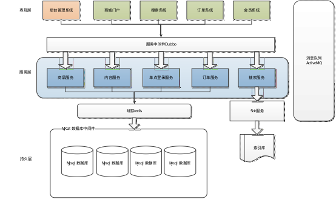
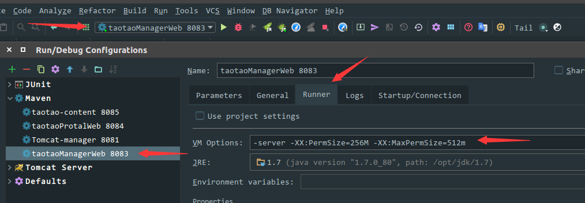
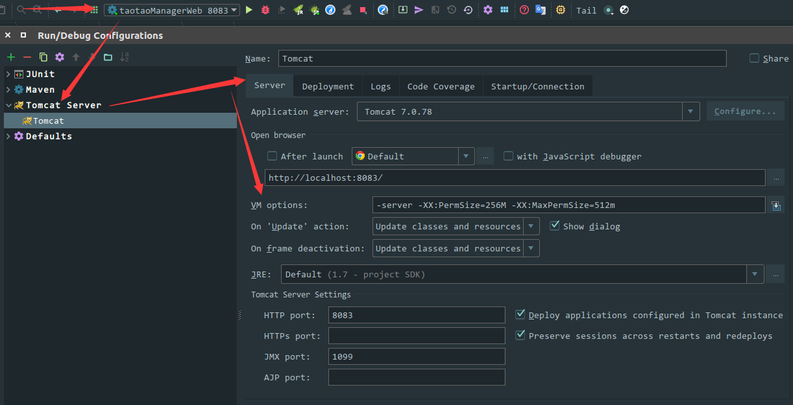
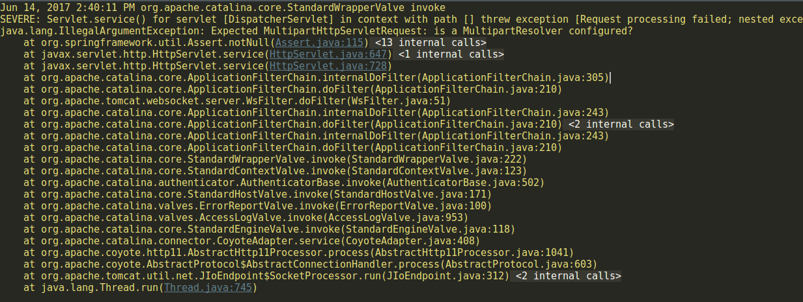
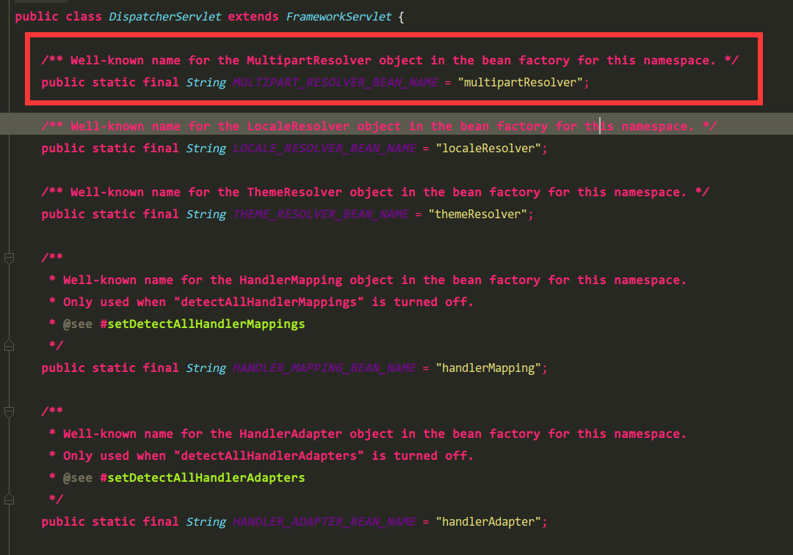

# shoppingMall
使用主流框架组合SSM开发,并引入新技术,全面丰富的一个商城项目,美其名曰"京东商城"

## 项目起源
这个项目全名叫"淘淘商城",是大陆某培训机构压轴的一个项目.项目是几年前就已经出来了,每一届的项目都在改进.做这个项目的原因是项目里融汇了许多的知识点,做一遍下来可以开阔下自己的眼界.不得不说,在网上论坛里面大量地黑培训机构可能是太片面了点,把项目的整个流程做下来的话,最起码能了解很大一部分项目中涉及的技术点,当然也要看个人了,反观我们大陆大部分普通高校毕业学生出来在**项目经验**上确实没办法相比,当然仅仅只能说是项目编码经验上.反正我个人认为还是取决于自己吧！  

   整个项目的弊端也很容易看出来:  
 - 教学时间太短暂,带来的就是思考的时间不是很多
 - 前端页面是直接提供的,你只能粘贴复制,完全不用考虑页面出现的各种问题
 - 很多知识点一带而过,不讲技术原理,直接给出解决办法 
  
  利益都是相对的,优点也是很明显:
 - 对于很多想找工作的人来说培训出来很快找到份工作 
 - 对于大多数普通高校毕业生培训接触到的知识点是在学校无法接触到的
 - 项目经验不同于书本上的项目讲解,知识点比较新颖,碰到问题可以寻求帮助
 - 跟一群能大部分志同道合的人一起学习氛围会更加好
 
 
## 项目环境

* **操作系统** : Ubuntu 17.04 (视频开发采用Windows7,部署项目使用Centos虚拟机)
* **IDE** ：IntelliJ IDEA 2017.1.1 x64 (视频是用Eclipse,如果用IDEA的话有些坑你是肯定会碰见的)
* **JDK** : JDK1.7 (一开始使用1.8搭建,后来跟dubbo出现了冲突智能换回1.7)
* **Web容器** ： Tomcat (视频里面使用Maven Tomcat插件)
* **数据库** ：Mysql-5.7.17-winx64    
* **依赖管理工具** : Maven  整个项目非常依赖Maven
* **版本控制工具** : Git (视频里面使用SVN,我这里使用的是Git)

## 项目概述
  + 项目最终Maven模块数量为26个,不区分父子模块
  
  + 项目最终部署Tomcat情况,前半部分为部署项目名,后面数字为端口号
  
  + IDEA中项目图
  
  + 系统构架图(项目给出的图)
  
  
## 开发流程
 要么你就跟着视频一步一步走下去,每天都有教学笔记的,如果你是想过一遍技术点的话,完全可以根据每天的文档跟源代码自己练习下去,文档真的很详细,分为`PDF`跟`Doc`两种版本,简直就是一步步地教你开发
  
  


## 项目中碰到的一些问题的总结  

###  ① java.lang.OutOfMemoryError thrown from the UncaughtExceptionHandler in thread "http-bio-8083-exec-1"  内存溢出
```html
java.lang.OutOfMemoryError thrown from the UncaughtExceptionHandler in thread "http-bio-8083-exec-1"
```
看到这个错误大概就知道是跟内存有点关系了,直接去`Tomcat`里面添加运行参数吧,下面是我在`IDEA`里面的做法
 - MAVEN tomcat插件
   
 - IDEA配置的Tomcat容器
   
参数:  ` -server -XX:PermSize=256M -XX:MaxPermSize=512m `
参数是根据你自己需求去改的,在你内存不是很紧张的情况下,尽量分配高一点的内存,减少`JVM`频繁`GC`次数,这里只是设置了几个基本的参数，参数的意义就是
   + `-server`是一个要为第一个参数的
   + `-XX:PermSize=256M` 持久区初始化的内存大小
   + `-XX:MaxPermSize=512m ` 持久去最大的内存大小
  

###  ② SpringMvc文件上传失败问题
在进行文件上传的时候出现一个这样的问题  
  
仔细一看,我猜测是Spring文件上传的配置没有配置,然后去``applicationContext-Mvc.xml``中看了下我的配置文件
````xml
 <bean id="commonsMultipartResolver" class="org.springframework.web.multipart.commons.CommonsMultipartResolver">
        <!--设置默认的编码-->
        <property name="defaultEncoding" value="UTF-8"/>
        <!--设置文件上传的最大值-->
        <property name="maxUploadSize" value="5242880"/>
    </bean>
````  
我感觉也没有配错,然后查了下资料,发现``bean``的名字错了,改为
```xml
 <bean id="multipartResolver" class="org.springframework.web.multipart.commons.CommonsMultipartResolver">
        <!--设置默认的编码-->
        <property name="defaultEncoding" value="UTF-8"/>
        <!--设置文件上传的最大值-->
        <property name="maxUploadSize" value="5242880"/>
    </bean>
```
原理`DispatcherServlet`

这里把bean的名字固定了的

### ③ 搭建redis集群的时候无法安装Ruby搭建集群脚本
执行`gem install redis-3.0.0.gem`是报错的，找不到这个东西
```
ERROR:  Could not find a valid gem 'redis-3.0.0.gem' (>= 0) in any repository
```
然后`Google`找到了[官网的脚本](https://rubygems.org/gems/redis/versions/3.0.0?locale=zh-CN)
```
gem install redis -v 3.0.0
```

### 　④ 操作redis集群出现异常
部分异常出错代码:  
```
redis.clients.jedis.exceptions.JedisMovedDataException: MOVED 11149 127.0.0.1:7001

	at redis.clients.jedis.Protocol.processError(Protocol.java:108)
	at redis.clients.jedis.Protocol.process(Protocol.java:142)
	at redis.clients.jedis.Protocol.read(Protocol.java:196)
	at redis.clients.jedis.Connection.readProtocolWithCheckingBroken(Connection.java:288)
	at redis.clients.jedis.Connection.getStatusCodeReply(Connection.java:187)

```
这个错误的原因就是跟`redis`集群有关系，`redis`把这个key分配到了`127.0.0.1:7001`节点上去了，然后并没有找到这个节点，所以报错了.查看`applicationContext-redis.xml`文件  
```xml
<?xml version="1.0" encoding="UTF-8"?>
<beans xmlns="http://www.springframework.org/schema/beans"
       xmlns:xsi="http://www.w3.org/2001/XMLSchema-instance"
       xsi:schemaLocation="http://www.springframework.org/schema/beans http://www.springframework.org/schema/beans/spring-beans-4.2.xsd">
    <!--单机版跟集群版只能选其中一个-->
    <!-- 1.配置单机版的连接 -->
     <bean id="jedisPool" class="redis.clients.jedis.JedisPool">
         <constructor-arg name="host" value="127.0.0.1"/>
         <constructor-arg name="port" value="6379"/>
     </bean>
     <bean id="jedisClientPool" class="com.taotao.jedis.JedisClientPool"/>

    <!-- 2.集群版的配置 -->
    <!-- <bean id="jedisCluster" class="redis.clients.jedis.JedisCluster">
        <constructor-arg>
            <set>
                <bean class="redis.clients.jedis.HostAndPort">
                    <constructor-arg name="host" value="127.0.0.1"/>
                    <constructor-arg name="port" value="6379"/>
                </bean>
                <bean class="redis.clients.jedis.HostAndPort">
                    <constructor-arg name="host" value="127.0.0.1"/>
                    <constructor-arg name="port" value="7000"/>
                </bean>
                <bean class="redis.clients.jedis.HostAndPort">
                    <constructor-arg name="host" value="127.0.0.1"/>
                    <constructor-arg name="port" value="7001"/>
                </bean>
                <bean class="redis.clients.jedis.HostAndPort">
                    <constructor-arg name="host" value="127.0.0.1"/>
                    <constructor-arg name="port" value="7002"/>
                </bean>
                <bean class="redis.clients.jedis.HostAndPort">
                    <constructor-arg name="host" value="127.0.0.1"/>
                    <constructor-arg name="port" value="7003"/>
                </bean>
                <bean class="redis.clients.jedis.HostAndPort">
                    <constructor-arg name="host" value="127.0.0.1"/>
                    <constructor-arg name="port" value="7004"/>
                </bean>
            </set>
        </constructor-arg>
    </bean>
    <bean id="jedisClientCluster" class="com.taotao.jedis.JedisClientCluster"/>    -->
 </beans>
```
可以发现这里其实是配置一个`单机版`跟`集群版`的两个配置,然后这里是使用了`单机版`的，所以的话集群是使用不了的,然后就会出现这个错误了，把`单机版`的配置注释掉，再把`集群版`的**取消注释**就可以了,如下:
````xml
<?xml version="1.0" encoding="UTF-8"?>
<beans xmlns="http://www.springframework.org/schema/beans"
       xmlns:xsi="http://www.w3.org/2001/XMLSchema-instance"
       xsi:schemaLocation="http://www.springframework.org/schema/beans http://www.springframework.org/schema/beans/spring-beans-4.2.xsd">
     <!--单机版跟集群版只能选其中一个-->
    <!-- 1.配置单机版的连接 -->
    <!--    <bean id="jedisPool" class="redis.clients.jedis.JedisPool">
         <constructor-arg name="host" value="127.0.0.1"/>
         <constructor-arg name="port" value="6379"/>
     </bean>
     <bean id="jedisClientPool" class="com.taotao.jedis.JedisClientPool"/>    -->

    <!-- 2.集群版的配置 -->
     <bean id="jedisCluster" class="redis.clients.jedis.JedisCluster">
        <constructor-arg>
            <set>
                <bean class="redis.clients.jedis.HostAndPort">
                    <constructor-arg name="host" value="127.0.0.1"/>
                    <constructor-arg name="port" value="6379"/>
                </bean>
                <bean class="redis.clients.jedis.HostAndPort">
                    <constructor-arg name="host" value="127.0.0.1"/>
                    <constructor-arg name="port" value="7000"/>
                </bean>
                <bean class="redis.clients.jedis.HostAndPort">
                    <constructor-arg name="host" value="127.0.0.1"/>
                    <constructor-arg name="port" value="7001"/>
                </bean>
                <bean class="redis.clients.jedis.HostAndPort">
                    <constructor-arg name="host" value="127.0.0.1"/>
                    <constructor-arg name="port" value="7002"/>
                </bean>
                <bean class="redis.clients.jedis.HostAndPort">
                    <constructor-arg name="host" value="127.0.0.1"/>
                    <constructor-arg name="port" value="7003"/>
                </bean>
                <bean class="redis.clients.jedis.HostAndPort">
                    <constructor-arg name="host" value="127.0.0.1"/>
                    <constructor-arg name="port" value="7004"/>
                </bean>
            </set>
        </constructor-arg>
    </bean>
    <bean id="jedisClientCluster" class="com.taotao.jedis.JedisClientCluster"/>   
</beans>
````
### ⑤ 页面EL表达式无效问题
在搜索模块这个页面上,`EL`表达式一直是直接显示文字的，没有显示出解析出来的值,看到这个话根据以前的经验，根本就没有解析表达式,直接去查看`web.xml`,我这个文件是`IDEA`生成`Maven webapp`那个骨架自动生成的,有点坑呀
````xml
<!DOCTYPE web-app PUBLIC
        "-//Sun Microsystems, Inc.//DTD Web Application 2.3//EN"
        "http://java.sun.com/dtd/web-app_2_3.dtd" >
<web-app>
       中间省略
</web-app>
````
果然看这个问题就出来,`Sevlet2.4`开始`JSP`页面有一个指令默认为`false`
````jsp
<%@ page isELIgnored="false" %>
````
但是上一个版本`Servlet2.0`中有说法也是说默认为`false`的,在[Oracle官网](http://oracle.com)找了下找到具体的说明，找到了这篇文档[https://docs.oracle.com/cd/E19316-01/819-3669/bnaic/index.html](https://docs.oracle.com/cd/E19316-01/819-3669/bnaic/index.html),
截取部分文档内容：
```html
Deactivating Expression Evaluation
Because the patterns that identify EL expressions, ${ } and #{ }, were not reserved in the JSP specifications before JSP 2.0, there might exist applications in which such patterns are intended to pass through verbatim. To prevent the patterns from being evaluated, you can deactivate EL evaluation using one of the following methods:

Escape the #{ or ${ characters in the page.

Configure the application with a JSP Property Group.

Configure the page with the page directive.

To escape the #{ or ${ characters in the page, you use the \ character as follows:

some text \#{ some more\${ text
<my:tag someAttribute="sometext\#{more\${text" />
Another way to deactivate EL evaluation is by using a JSP property group to either allow the #{ characters as a String literal using the deferred-syntax-allowed-as-literal subelement, or to treat all expressions as literals using the el-ignored subelement:

<jsp-property-group>
    <deferred-syntax-allowed-as-literal>
        true
    </deferred-syntax-allowed-as-literal>
</jsp-property-group>
or

<jsp-property-group>
    <el-ignored>true</el-ignored>
</jsp-property-group>
Finally, you can configure the page with the page directive to either accept the #{ characters as String literals with the deferredSyntaxAllowedAsLiteral attribute, or to ignore all EL expressions using the isELIgnored attribute:

<%@page ... deferredSyntaxAllowedAsLiteral="true" %>
or

<%@ page isELIgnored ="true" %>
The valid values of these attributes are true and false. If isELIgnored is true, EL expressions are ignored when they appear in static text or tag attributes. If it is false, EL expressions are evaluated by the container only if the attribute has rtexprvalue set to true or the expression is a deferred expression.

The default value of isELIgnored varies depending on the version of the web application deployment descriptor. The default mode for JSP pages delivered with a Servlet 2.4 descriptor is to evaluate EL expressions; this automatically provides the default that most applications want. The default mode for JSP pages delivered using a descriptor from Servlet 2.3 or before is to ignore EL expressions; this provides backward compatibility.
```
这里就是教你怎么禁用`EL表达式`,不过我是真的没有想到为什么要禁用它,这里就说到了一句话
`Finally, you can configure the page with the page directive  to ignore all EL expressions using the isELIgnored attribute`  
忽略的指令就是:
```html
<%@ page isELIgnored ="true" %>
```
最后还有一句话就是出现这个问题的原因了:
`The default value of isELIgnored varies depending on the version of the web application deployment descriptor. The default mode for JSP pages delivered with a Servlet 2.4 descriptor is to evaluate EL expressions; this automatically provides the default that most applications want. The default mode for JSP pages delivered using a descriptor from Servlet 2.3 or before is to ignore EL expressions; this provides backward compatibility.`
翻译过来的大意就是`这个isELIgnored属性是要依赖 Web应用的版本的,默认在Servlet2.4开始就是false，也就是不忽略EL表达式,但是在Servlet2.3以前就是默认为true的,也就是默认为忽略EL表达式的`,这就是我们想要的答案,解决方法罗列出两种：
  + 直接修改`web.xml`中的`Servlet版本`,让它默认就是支持`EL`表达式的
   ```xml
  <web-app xmlns="http://java.sun.com/xml/ns/javaee"
           xmlns:xsi="http://www.w3.org/2001/XMLSchema-instance"
           xsi:schemaLocation="http://java.sun.com/xml/ns/javaee
                        http://java.sun.com/xml/ns/javaee/web-app_3_0.xsd"
           version="3.0"
           metadata-complete="true">
  </web-app>
  ```

  + 在`JSP`页面使用`page`指令指定这个值了
  ````jsp
<%@ page isELIgnored ="true" %>
````
 在这里我还找到另外一篇的文档,供参考[http://www.roseindia.net/tutorial/jsp/isELIgnoredAttribute.html](http://www.roseindia.net/tutorial/jsp/isELIgnoredAttribute.html),这里需要注意`Servlet`跟`Jsp`的版本号不要相混淆了  
 防止和谐贴出部分文档:
 ````html
Page Directive attribute - isELIgnored
This tutorial contains description of isELIgnored attribute of page Directive.

isELIgnored Attribute :

page directive provides isELIgnored attribute which is of boolean type. This attribute controls the JSP Expression Language. The cause to use Expression Language is to eliminate java, Code from the Jsp. The true value of this attribute indicates that any Expression Language is ignored. False value allow you to use the EL. 
For JSP 1.2 version the default value of isELIgnored is true but for JSP 2.0 version and above the default value is false.

Syntax :

<%@ page isELIgnored="false" %> <!-- default value for JSP 2.0 -->

<%@ page isELIgnored="true" %> <!-- default value for JSP 1.2 -->
````
 


